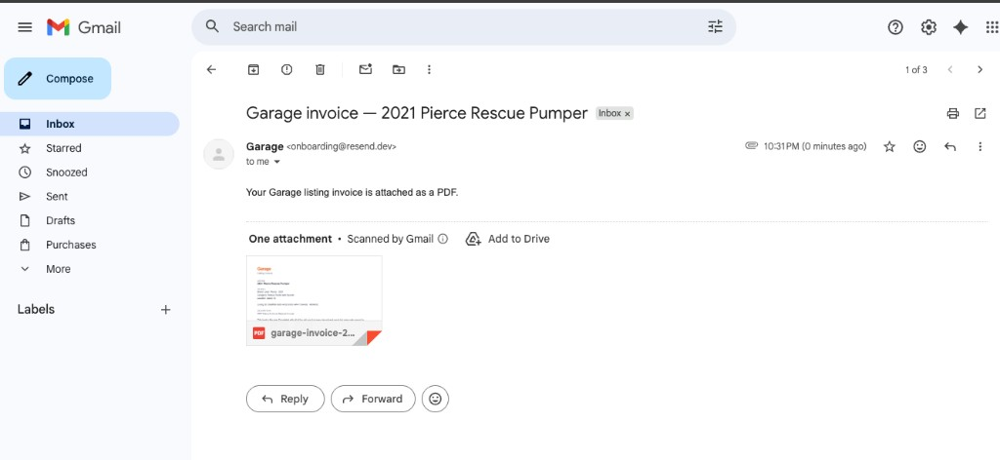
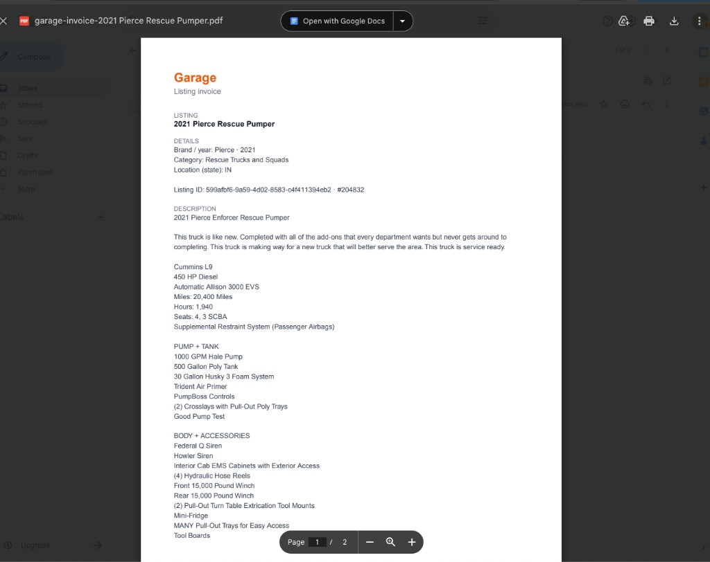

# Garage

Next.js app for **ShopGarage listing invoices**: generate a PDF from a listing URL or UUID, download it in the browser, or email it as an attachment (via [Resend](https://resend.com)).

## Requirements

- Node.js 18+

## Getting started

1. Clone the repository and open the project root in a terminal.
2. Install dependencies: `npm install`
3. Start the dev server: `npm run start`
4. Open [http://localhost:3000](http://localhost:3000), paste a ShopGarage listing URL (or listing UUID), then use **Download invoice** or **Email invoice**.

5. **Email invoice (Resend):** [Resend](https://resend.com) is configured so outbound mail only reaches allowed recipients (e.g. the account owner). For **Email invoice** to succeed, set the recipient field to **`simongarageapp@gmail.com`**. Other addresses will not receive mail with the current Resend setup.

   To open that inbox and confirm delivery:
   - **Email:** `simongarageapp@gmail.com`
   - **Password:** `Garage1234678!`

   **What you should see:** an email from **Garage** (`onboarding@resend.dev`) with subject like `Garage invoice — …` and the listing PDF attached (Gmail may show a thumbnail preview).

   

   Opening the attachment shows the generated invoice (example: **2021 Pierce Rescue Pumper** listing with details, description, and amounts).

   

6. For a production-style run locally: `npm run build` then `npm run start:prod`.

## HTTP API

| Method | Path                 | Purpose                                                                 |
| ------ | -------------------- | ----------------------------------------------------------------------- |
| `POST` | `/api/invoice`       | JSON body `{ "listingUrl": "<url or uuid>" }` → PDF stream              |
| `POST` | `/api/invoice/email` | JSON body `{ "listingUrl": "...", "to": "..." }` → sends email with PDF |

Listing data is loaded from the Garage listings API; the server uses a base URL defined in `listingService` (see Configuration).

## Project layout

```
app/
  api/invoice/          # Route handlers (thin): parse body, call services, return Response
  lib/                  # Shared helpers (e.g. UUID parsing, email validation)
  lib/invoice/
    formatCurrency.ts   # Shared formatting (used by the PDF doc)
    backend/
      InvoicePdfDocument.tsx   # @react-pdf document (`import "server-only"`)
  services/
    backend/            # Server-only: listing fetch + PDF pipeline, generic email send
    frontend/           # `"use client"` modules: fetch wrappers + browser download UX
  types/                # e.g. GarageListing
  uiKit/                # Buttons, fields, alerts
  page.tsx              # Home UI
```

**Convention:** put anything that must never run in the browser under `services/backend/` (and use `import "server-only"` where it helps). Put `fetch` + DOM helpers used from Client Components under `services/frontend/`.

## Configuration

Today several values are hardcoded for a quick demo. For a real deployment, read them from **environment variables** (Next.js: `process.env.*` in server code, define values in `.env.local` for local dev and in your host’s env for production).

- **Resend** (`app/services/backend/emailService.ts`): move the API key and the `from` address into env vars (for example `RESEND_API_KEY` and `EMAIL_FROM`) so they are not committed to git.
- **Listings API base URL** (`app/services/backend/listingService.ts`): `DEFAULT_API_BASE` is currently a constant pointing at the Garage backend. The same value should become an env-driven setting (for example `GARAGE_API_BASE` or `LISTINGS_API_URL`) with a sensible default or validation at startup, so staging and production can target different hosts without code changes.
